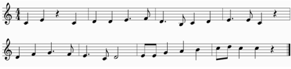

```{r setup, include=FALSE}
library(flexdashboard)
library(shiny)
```


Melodic Exercises
=====================================  

Row
-------------------------------------

### Introduction {data-width=50%}

Below you will find serveral melodic examples to help you practice sight-reading over the next couple weeks. In each of the rows below, I have included the music exercise in the left-side panel. I have also recorded an answer key for each example that you can use to check your work which is located in the right-side panel next to each exercise.

Directly to the right you'll find a C-Major scale and triad to help you get started. 

### C-Major Scale {data-width=50%}
```{r}
tags$audio(src = "./www/mp3/CMajorScale.mp3", type = "audio/mp3", autoplay = NA, controls = NA)
```

Row
-------------------------------------
    
### Melodic 1 {data-width=80%, data-height=150}

    
### Melodic 1 Audio {data-width=20%, data-height=150}

```{r}
tags$audio(src = "./www/mp3/4_5Melodic1.mp3", type = "audio/mp3", autoplay = NA, controls = NA)
```

Row
-------------------------------------
    
### Melodic 2 {data-width=80%, data-height=150}

    
### Melodic 2 Audio {data-width=20%, data-height=150}

```{r}
tags$audio(src = "./www/mp3/4_5Melodic2.mp3", type = "audio/mp3", autoplay = NA, controls = NA)
```

Row
-------------------------------------
    
### Melodic 3 {data-width=80%, data-height=150}

    
### Melodic 3 Audio {data-width=20%, data-height=150}

```{r}
tags$audio(src = "./www/mp3/4_5Melodic3.mp3", type = "audio/mp3", autoplay = NA, controls = NA)
```

Row
-------------------------------------
    
### Melodic 4 {data-width=80%, data-height=150}

    
### Melodic 4 Audio {data-width=20%, data-height=150}

```{r}
tags$audio(src = "./www/mp3/4_5Melodic4.mp3", type = "audio/mp3", autoplay = NA, controls = NA)
```

Row
-------------------------------------
    
### Melodic 5 {data-width=80%, data-height=150}

    
### Melodic 5 Audio {data-width=20%, data-height=150}

```{r}
tags$audio(src = "./www/mp3/4_5Melodic5.mp3", type = "audio/mp3", autoplay = NA, controls = NA)
```

Row
-------------------------------------
    
### Melodic 6 {data-width=80%, data-height=150}

    
### Melodic 6 Audio {data-width=20%, data-height=150}

```{r}
tags$audio(src = "./www/mp3/4_5Melodic6.mp3", type = "audio/mp3", autoplay = NA, controls = NA)
```

Rhythmic Exercises
=====================================  

Row
-------------------------------------

### Introduction {data-width=100%}

Below you will find serveral rhythmic examples to help you practice sight-reading over the next couple weeks. In each of the rows below, I have included the music exercise in the left-side panel. I have also recorded an answer key for each example that you can use to check your work which is located in the right-side panel next to each exercise.

Row
-------------------------------------
    
### Rhythmic 1 {data-width=80%, data-height=150}

    
### Rhythmic 1 Audio {data-width=20%, data-height=150}

```{r}
tags$audio(src = "./www/mp3/4_5Rhythmic1.mp3", type = "audio/mp3", autoplay = NA, controls = NA)
```

Row
-------------------------------------
    
### Rhythmic 2 {data-width=80%, data-height=150}

    
### Rhythmic 2 Audio {data-width=20%, data-height=150}

```{r}
tags$audio(src = "./www/mp3/4_5Rhythmic2.mp3", type = "audio/mp3", autoplay = NA, controls = NA)
```

Row
-------------------------------------
    
### Rhythmic 3 {data-width=80%, data-height=150}

    
### Rhythmic 3 Audio {data-width=20%, data-height=150}

```{r}
tags$audio(src = "./www/mp3/4_5Rhythmic3.mp3", type = "audio/mp3", autoplay = NA, controls = NA)
```

Row
-------------------------------------
    
### Rhythmic 4 {data-width=80%, data-height=150}

    
### Rhythmic 4 Audio {data-width=20%, data-height=150}

```{r}
tags$audio(src = "./www/mp3/4_5Rhythmic4.mp3", type = "audio/mp3", autoplay = NA, controls = NA)
```

Row
-------------------------------------
    
### Rhythmic 5 {data-width=80%, data-height=150}

    
### Rhythmic 5 Audio {data-width=20%, data-height=150}

```{r}
tags$audio(src = "./www/mp3/4_5Rhythmic5.mp3", type = "audio/mp3", autoplay = NA, controls = NA)
```

Row
-------------------------------------
    
### Rhythmic 6 {data-width=80%, data-height=150}

    
### Rhythmic 6 Audio {data-width=20%, data-height=150}

```{r}
tags$audio(src = "./www/mp3/4_5Rhythmic6.mp3", type = "audio/mp3", autoplay = NA, controls = NA)
```

